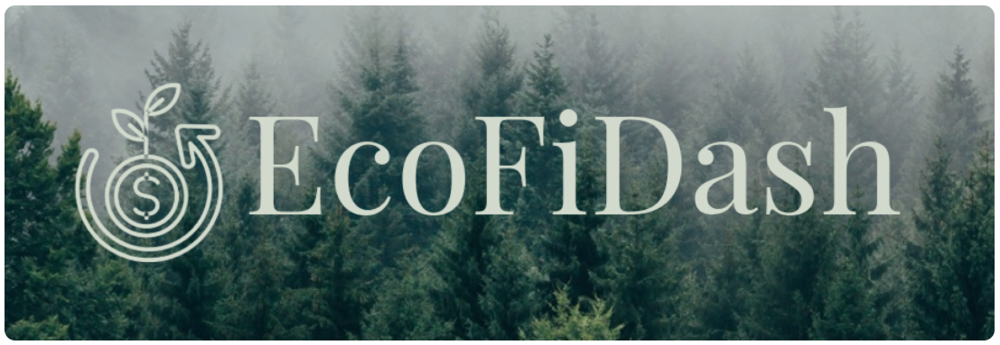

# EcoFiDash 
An eco-friendly dashboard providing personalized insights and sustainable spending recommendation

## Inspiration
Consumers increasingly seek sustainable options in their spending experiences, but often lack the information and incentives to make eco-friendly choices. This disconnect contributes to environmental degradation and limits the growth of recommerce—a market with the potential to significantly reduce carbon footprints and waste. Current recommerce participation is low, with less than 20% of consumers aware of the options available. Closing this gap can create economic opportunities and foster sustainable consumption patterns​.
## What it does
EcoFiDash addresses this critical issue by offering a comprehensive solution for tracking and optimizing sustainable transactions.

Our innovative platform transforms how consumers interact with their spending data through a personalized dashboard that seamlessly integrates with their transaction history. Key features include:
- **Carbon Footprint Tracking:** EcoFiDash calculates and visualizes the carbon footprint of each transaction, helping users understand their environmental impact in real-time.
- **Sustainable Business Recommendations:** Based on spending habits, our AI-driven system suggests eco-friendly alternatives, encouraging sustainable purchasing decisions.
- **AI Chatbot Assistance:** An integrated chatbot provides personalized insights into spending patterns and environmental impact, enhancing user awareness and engagement.
- **Recommerce Incentives:** EcoFiDash promotes recommerce by highlighting resale and redistribution options, offering rewards for sustainable spending behaviors.
## Product Walkthrough
- **Data Collection**: EcoFiDash collects transaction data through given database from Visa organizer and API integrations, which is then processed to calculate the user's carbon footprint.
- **Analysis and Recommendations**: Advanced AI text-prompt algorithms analyze spending habits and environmental impact, providing tailored suggestions for sustainable alternatives.
- **Visualization and Engagement**: A user-friendly dashboard displays carbon footprint metrics and offers interactive features like an AI chatbot for continuous engagement and education.
## How to use it
Setting Up: [SETUP.md](https://github.com/StephanieNhiLe/Visa-Climate-Tech-Hackathon/blob/66fed7a845ff6e16eba37d97d6db987f67bff04a/SETUP.md)
## How we built it
EcoFiDash was developed with a focus on leveraging data to drive sustainable spending habits. 
- The platform uses Flask as backend and React JS for front-end and its robust ecosystem and efficient rendering, while Tailwind CSS provides a modern, customizable design. 
- Integration with OpenAI and Ecolytiq APIs enables advanced AI functionalities and detailed carbon footprint environmental insights.
## What's next for EcoFiDash
Looking forward, we aim to enhance EcoFiDash by expanding its language support and incorporating predictive analytics to further anticipate and influence consumer behavior. Partnering with major financial institutions like Visa, we plan to create a community-driven platform that connects users with recommerce businesses, fostering a culture of sustainability and environmental responsibility.
